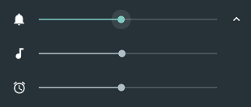

# Android-SoundQuickSettings
A simple Quick Settings Tile to control the sound volume

1. Add the tile to the quick settings  

2. Tap the tile to control the current volume stream  

3. And expand to control other volume streams  

